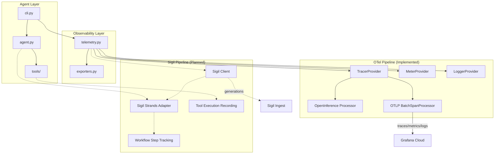
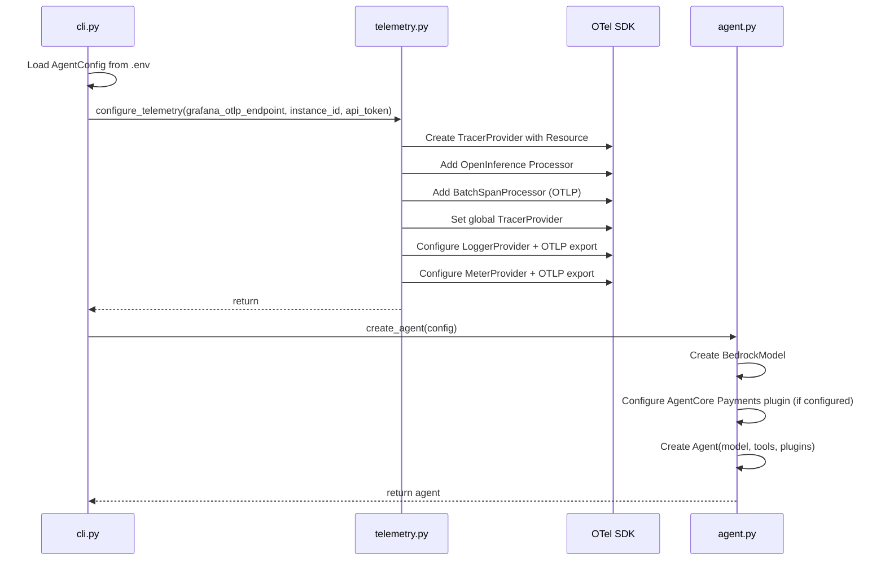
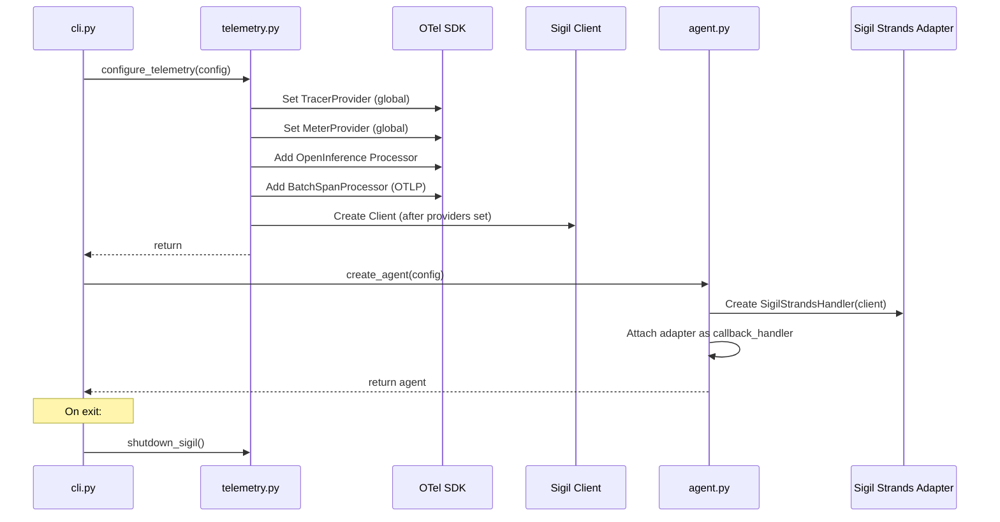

# Design Document: Sigil Instrumentation

## Overview

This design adds Grafana Sigil SDK instrumentation to the existing vending machine purchasing agent. The integration provides AI-specific observability (generation tracking, tool execution metrics, workflow pipeline visualization) alongside the existing OpenInference trace visualization and OTLP export to Grafana.

**Key Design Decisions:**

1. **Additive integration** — Sigil is layered on top of the existing OTel pipeline without modifying OpenInference behavior.
2. **Initialization order** — Sigil Client is created *after* TracerProvider and MeterProvider are set globally, since the SDK emits internal OTel spans/metrics.
3. **Adapter-first approach** — The `sigil-sdk-strands` callback handler captures generations automatically; explicit instrumentation is only used for tool execution recording and workflow steps.
4. **Graceful degradation** — Every Sigil operation is wrapped in try/except so failures never interrupt the core agent loop.

**Implementation Status:**

| Component | Status | Notes |
|-----------|--------|-------|
| Dependencies (pyproject.toml) | ✅ Implemented | `sigil-sdk>=0.1.2`, `sigil-sdk-strands>=0.1.0`, `hypothesis>=6.100.0` |
| Environment docs (.env.example) | ✅ Implemented | All Sigil vars documented under `# Observability — Sigil` |
| AgentConfig fields | ✅ Implemented | All 5 fields + `sigil_configured` property |
| Sigil Client init (telemetry.py) | ❌ Not started | No `_sigil_client`, `get_sigil_client()`, or `shutdown_sigil()` yet |
| Strands adapter (agent.py) | ❌ Not started | No callback_handler or SigilStrandsHandler attachment |
| CLI shutdown (cli.py) | ❌ Not started | No `shutdown_sigil()` call in finally block |
| Tool instrumentation | ❌ Not started | No `sigil_tool_wrapper` decorator or `sigil_tools.py` |
| Coexistence logic | ❌ Not started | `configure_telemetry()` does not handle Sigil scenarios |

## Architecture



*Solid lines = implemented. Dashed lines = planned.*

**Current Initialization Sequence (Implemented):**



**Planned Initialization Sequence (with Sigil):**



## Components and Interfaces

### 1. AgentConfig (config.py) — ✅ IMPLEMENTED

Extended with Sigil-specific settings using pydantic-settings validation.

```python
class AgentConfig(BaseSettings):
    """Configuration for the AI agent."""

    # ... existing fields (AWS, Vending Machine, Bedrock, Payments, Observability) ...

    # Sigil
    sigil_endpoint: str = ""
    sigil_protocol: Literal["http/protobuf", "grpc"] = "http/protobuf"
    sigil_auth_mode: Literal["token", "basic", "tenant"] = "token"
    sigil_auth_tenant_id: str = ""
    sigil_auth_token: str = ""

    model_config = {"env_file": ".env", "env_file_encoding": "utf-8", "extra": "ignore"}

    @property
    def sigil_configured(self) -> bool:
        """True when all required Sigil credentials are present."""
        return bool(
            self.sigil_endpoint.strip()
            and self.sigil_auth_tenant_id.strip()
            and self.sigil_auth_token.strip()
        )
```

**Interface:**
- `sigil_configured` → `bool`: Returns True only when endpoint, tenant_id, and token all contain non-whitespace.
- Pydantic `Literal` types enforce valid values for `sigil_protocol` and `sigil_auth_mode` at initialization time.

**Current file location:** `src/agent/config.py`

### 2. Telemetry Module (telemetry.py) — ⚠️ PARTIALLY IMPLEMENTED

The telemetry module currently handles OpenInference + OTLP export to Grafana Cloud. It supports two configuration modes (OTEL env vars or explicit Grafana params) and configures traces, logs, and metrics export.

**Current state** (`src/observability/telemetry.py`):
- ✅ `_configured` flag to prevent double-initialization
- ✅ `configure_telemetry()` with Grafana OTLP params
- ✅ OpenInference processor + BatchSpanProcessor
- ✅ LoggerProvider + OTLP log export
- ✅ MeterProvider + OTLP metric export
- ❌ No `_sigil_client` module-level variable
- ❌ No `get_sigil_client()` accessor
- ❌ No `shutdown_sigil()` function
- ❌ No Sigil Client initialization logic

**Planned additions:**

```python
# Module-level state (to be added)
_sigil_client: Optional[SigilClient] = None

def get_sigil_client() -> Optional[SigilClient]:
    """Return the Sigil client instance, or None if not initialized."""
    return _sigil_client

def shutdown_sigil() -> None:
    """Flush and shut down the Sigil client if initialized."""
    global _sigil_client
    if _sigil_client is not None:
        try:
            _sigil_client.shutdown()
        except Exception as e:
            logger.warning("Sigil shutdown failed: %s", e)
```

**Planned `configure_telemetry` update:**
The function signature will be updated to accept the full `AgentConfig` (or individual Sigil params) and initialize the Sigil Client after TracerProvider and MeterProvider are set globally.

### 3. Agent Module (agent.py) — ⚠️ NOT YET UPDATED FOR SIGIL

The agent module currently creates a Strands Agent with BedrockModel, tools, and optional AgentCore Payments plugin. It does not yet integrate the Sigil Strands adapter.

**Current state** (`src/agent/agent.py`):
- ✅ `create_agent(config)` creates Agent with model, tools, plugins
- ✅ AgentCore Payments plugin conditionally attached
- ❌ No `get_sigil_client()` import
- ❌ No `SigilStrandsHandler` creation
- ❌ No `callback_handler` parameter passed to Agent

**Planned addition:**

```python
def create_agent(config: AgentConfig) -> Agent:
    # ... existing model/plugins setup ...

    callback_handler = None
    sigil_client = get_sigil_client()
    if sigil_client:
        try:
            from sigil_sdk_strands import SigilStrandsHandler
            callback_handler = SigilStrandsHandler(
                sigil_client=sigil_client,
                agent_name="get-me-a-coke-agent",
                conversation_title="Vending Machine Purchase",
            )
        except (ImportError, Exception) as e:
            logger.warning("Sigil Strands adapter unavailable: %s", e)

    agent = Agent(
        model=model,
        system_prompt=get_system_prompt(config),
        tools=[list_products, purchase_product, wallet_get_balance, wallet_pay],
        plugins=plugins,
        callback_handler=callback_handler,
    )
    return agent
```

### 4. CLI Module (cli.py) — ⚠️ NOT YET UPDATED FOR SIGIL

The CLI module currently dispatches to single-shot or interactive mode. It calls `configure_telemetry()` only when `observability_configured` is True. It does not call `shutdown_sigil()` on exit.

**Current state** (`src/agent/cli.py`):
- ✅ Loads `AgentConfig` from .env
- ✅ Calls `configure_telemetry()` with Grafana params when configured
- ❌ No try/finally block around mode dispatch
- ❌ No `shutdown_sigil()` call on exit
- ❌ Does not pass Sigil config to `configure_telemetry()`

**Planned addition:**

```python
def main() -> None:
    # ... existing setup ...

    # Initialize observability (must happen before agent creation)
    configure_telemetry(config)  # Updated to accept full config

    try:
        if args.interactive or args.instruction is None:
            run_interactive(config)
        else:
            run_single_shot(config, args.instruction)
    finally:
        shutdown_sigil()
```

### 5. Tool Execution Instrumentation — ❌ NOT IMPLEMENTED

The Sigil Strands adapter (`sigil-sdk-strands`) is expected to automatically capture tool executions when attached as a callback handler. The adapter intercepts tool invocations via the Strands callback lifecycle, recording:
- Tool name
- Input arguments
- Output result
- Duration (ms)
- Success/failure status

If the adapter does not capture tool executions automatically, a lightweight decorator wrapper will be created in a new file `src/observability/sigil_tools.py`:

```python
def sigil_tool_wrapper(tool_fn):
    """Wrap a tool function to record execution in Sigil."""
    @functools.wraps(tool_fn)
    def wrapper(*args, **kwargs):
        client = get_sigil_client()
        if client is None:
            return tool_fn(*args, **kwargs)

        start = time.time()
        try:
            result = tool_fn(*args, **kwargs)
            duration_ms = (time.time() - start) * 1000
            client.start_tool_execution(
                tool_name=tool_fn.__name__,
                input_args=kwargs,
                output=result,
                duration_ms=duration_ms,
                success=True,
            )
            return result
        except Exception as e:
            duration_ms = (time.time() - start) * 1000
            try:
                client.start_tool_execution(
                    tool_name=tool_fn.__name__,
                    input_args=kwargs,
                    output=str(e),
                    duration_ms=duration_ms,
                    success=False,
                )
            except Exception:
                logger.warning("Sigil tool recording failed for %s", tool_fn.__name__)
            raise
    return wrapper
```

### 6. Workflow Step Tracking — ❌ NOT IMPLEMENTED

The Sigil Strands adapter is configured with `capture_workflow_steps=True` to automatically detect graph nodes and create workflow steps with DAG edges. If the adapter does not support this, manual workflow step creation is used as a fallback.

## Data Models

### Sigil Configuration (within AgentConfig) — ✅ IMPLEMENTED

| Field | Type | Env Var | Default | Validation |
|-------|------|---------|---------|------------|
| `sigil_endpoint` | `str` | `SIGIL_ENDPOINT` | `""` | None |
| `sigil_protocol` | `Literal["http/protobuf", "grpc"]` | `SIGIL_PROTOCOL` | `"http/protobuf"` | Literal enum |
| `sigil_auth_mode` | `Literal["token", "basic", "tenant"]` | `SIGIL_AUTH_MODE` | `"token"` | Literal enum |
| `sigil_auth_tenant_id` | `str` | `SIGIL_AUTH_TENANT_ID` | `""` | None |
| `sigil_auth_token` | `str` | `SIGIL_AUTH_TOKEN` | `""` | None |

### Sigil Client Configuration (planned — passed to SDK)

```python
ClientConfig(
    generation_export=GenerationExportConfig(
        endpoint=config.sigil_endpoint,
        protocol=config.sigil_protocol,
    ),
    auth=AuthConfig(
        mode=config.sigil_auth_mode,
        tenant_id=config.sigil_auth_tenant_id,
        token=config.sigil_auth_token,
    ),
)
```

### Module-Level State (telemetry.py)

| Variable | Type | Status | Purpose |
|----------|------|--------|---------|
| `_configured` | `bool` | ✅ Exists | Prevents double-initialization |
| `_sigil_client` | `Optional[Client]` | ❌ Planned | Sigil client instance or None |

## Correctness Properties

*A property is a characteristic or behavior that should hold true across all valid executions of a system — essentially, a formal statement about what the system should do. Properties serve as the bridge between human-readable specifications and machine-verifiable correctness guarantees.*

### Property 1: Enum field validation rejects invalid values

*For any* string value that is not in the valid set for a `Literal`-typed configuration field (`sigil_protocol` accepts only "http/protobuf" and "grpc"; `sigil_auth_mode` accepts only "token", "basic", and "tenant"), constructing an `AgentConfig` with that invalid value SHALL raise a validation error.

**Validates: Requirements 2.2, 2.3, 2.7, 2.8**

### Property 2: sigil_configured reflects credential completeness

*For any* combination of three strings assigned to `sigil_endpoint`, `sigil_auth_tenant_id`, and `sigil_auth_token`, the `sigil_configured` property SHALL return `True` if and only if all three strings contain at least one non-whitespace character.

**Validates: Requirements 2.6**

### Property 3: Partial Sigil credentials prevent client creation

*For any* combination of Sigil credential values where at least one of (`sigil_endpoint`, `sigil_auth_tenant_id`, `sigil_auth_token`) is present and non-empty but not all three are present and non-empty, the telemetry module SHALL log a warning and SHALL NOT create a Sigil Client instance.

**Validates: Requirements 3.4**

### Property 4: Tool instrumentation transparency

*For any* tool function and any valid input arguments, the instrumented version of the tool SHALL return the exact same value as the uninstrumented version, regardless of whether the Sigil client is available, unavailable, or raises an error during recording.

**Validates: Requirements 5.4, 5.5, 9.3**

### Property 5: Failed tool execution records failure and re-raises

*For any* tool function that raises an exception during execution, the Sigil instrumentation SHALL record the tool execution with `success=False` and the exception message, and SHALL re-raise the original exception with its type and message unchanged.

**Validates: Requirements 5.2**

### Property 6: Tool execution recording captures all required fields

*For any* successful tool invocation with a Sigil client available, the recorded tool execution SHALL contain: tool name (matching the function name), input arguments (matching the call arguments), output (matching the return value), duration in milliseconds (non-negative number), and success status (boolean).

**Validates: Requirements 5.1**

### Property 7: Generation recording failure does not affect LLM response

*For any* LLM generation where the Sigil recording raises an exception, the agent SHALL still return the complete model response to the caller unchanged.

**Validates: Requirements 9.2**

## Error Handling

### Strategy: Defensive Wrapping with Logging

All Sigil operations follow a consistent error handling pattern:

1. **Import errors** — Caught at module load time. If `sigil-sdk` or `sigil-sdk-strands` is not installed, a WARNING is logged and the feature is disabled for the session.

2. **Initialization errors** — Caught during `configure_telemetry()`. If the Sigil Client constructor raises, the error is logged at ERROR level and `_sigil_client` remains `None`.

3. **Runtime recording errors** — Caught inside the tool wrapper and adapter callback. If `start_tool_execution()` or `enqueue_workflow_step()` raises, the error is logged at WARNING level and execution continues.

4. **Network errors** — The Sigil SDK handles HTTP failures internally (non-blocking). If the endpoint is unreachable, the SDK silently drops data without blocking the calling thread.

5. **Shutdown errors** — `shutdown_sigil()` checks for `None` before calling `shutdown()`. If shutdown itself raises, the error is caught and logged.

### Error Hierarchy

```
ImportError (sigil-sdk not installed)
  → Log WARNING, skip all Sigil features

Exception during Client() construction
  → Log ERROR, _sigil_client = None

Exception during SigilStrandsHandler() construction
  → Log WARNING, agent created without callback_handler

Exception during start_tool_execution()
  → Log WARNING, tool result returned unchanged

Exception during enqueue_workflow_step()
  → Log WARNING, agent continues

Exception during shutdown()
  → Log WARNING, application exits normally
```

### Key Invariant

**No Sigil failure ever propagates to the user or interrupts the agent loop.** Every Sigil call site is wrapped in try/except with a WARNING-level log. The agent's core functionality (LLM calls, tool execution, payment flow) is never gated on Sigil availability.

## Testing Strategy

### Unit Tests (pytest)

| Test Area | Status | What to Verify |
|-----------|--------|---------------|
| `AgentConfig` fields | ✅ Partial (defaults + payments + observability tested) | Default values, env var loading, Literal validation |
| `sigil_configured` property | ❌ Not tested | True/False for various credential combinations |
| `configure_telemetry` with Sigil | ❌ Not tested | Client created after providers, stored in module |
| `configure_telemetry` without Sigil | ✅ Tested | Graceful skip when creds missing |
| `configure_telemetry` import error | ❌ Not tested | WARNING logged, no crash |
| `create_agent` with Sigil client | ❌ Not tested | Adapter attached as callback_handler |
| `create_agent` without Sigil | ❌ Not tested | Agent created normally, no callback_handler |
| `shutdown_sigil` | ❌ Not tested | Calls shutdown() when client exists, no-op when None |
| Tool wrapper | ❌ Not tested | Records execution, handles failures, re-raises exceptions |

### Property-Based Tests (Hypothesis)

The project will use **Hypothesis** (Python's standard PBT library) for property-based testing. The `hypothesis>=6.100.0` dependency is already in `[dependency-groups].dev`.

Configuration:
- Minimum 100 examples per property test
- Each test tagged with: `# Feature: sigil-instrumentation, Property {N}: {title}`

| Property | Status | Generator Strategy |
|----------|--------|-------------------|
| P1: Enum validation | ❌ Not written | `st.text()` filtered to exclude valid values |
| P2: sigil_configured | ❌ Not written | `st.text()` for each of 3 fields (including whitespace-only) |
| P3: Partial credentials | ❌ Not written | `st.tuples(st.text(), st.text(), st.text())` with at least one empty |
| P4: Tool transparency | ❌ Not written | `st.dictionaries()` for tool kwargs, `st.booleans()` for client availability |
| P5: Failed tool re-raise | ❌ Not written | `st.sampled_from([ValueError, RuntimeError, ...])` for exception types |
| P6: Recording completeness | ❌ Not written | `st.text()` for tool name, `st.dictionaries()` for args |
| P7: Generation failure isolation | ❌ Not written | `st.text()` for model response, various exception types |

### Integration Tests

| Test Area | Status | What to Verify |
|-----------|--------|---------------|
| Full telemetry init | ❌ Not written | OTel providers + Sigil client created in correct order |
| Both pipelines active | ❌ Not written | Spans processed by OpenInference AND Sigil |
| Agent end-to-end | ❌ Not written | Agent runs with both instrumentations, produces correct output |
| Coexistence | ❌ Not written | OpenInference traces unaffected by Sigil presence |

### Test Organization

```
tests/
├── unit/
│   ├── test_agent/
│   │   ├── test_config.py              # ✅ Exists (partial Sigil coverage)
│   │   ├── test_agent.py               # ✅ Exists (no Sigil tests)
│   │   └── test_cli.py                 # ✅ Exists (no Sigil tests)
│   ├── test_observability/
│   │   └── test_telemetry.py           # ✅ Exists (no Sigil tests)
│   ├── test_config_sigil.py            # ❌ Planned — Config field tests
│   ├── test_telemetry_sigil.py         # ❌ Planned — Sigil init/shutdown tests
│   ├── test_agent_sigil_adapter.py     # ❌ Planned — Adapter attachment tests
│   └── test_tool_instrumentation.py    # ❌ Planned — Tool wrapper tests
├── property/
│   ├── test_config_properties.py       # ❌ Planned — P1, P2
│   ├── test_telemetry_properties.py    # ❌ Planned — P3
│   └── test_tool_properties.py         # ❌ Planned — P4, P5, P6, P7
└── integration/
    ├── conftest.py                     # ✅ Exists
    ├── test_agent_vending_machine.py   # ✅ Exists
    └── test_sigil_coexistence.py       # ❌ Planned — Full pipeline tests
```

### Current File Structure (Relevant to Sigil)

```
src/
├── agent/
│   ├── agent.py          # Agent creation — needs Sigil adapter integration
│   ├── cli.py            # CLI entry point — needs shutdown_sigil() call
│   ├── config.py         # ✅ AgentConfig with Sigil fields
│   └── tools/
│       ├── vending_machine.py  # list_products, purchase_product
│       └── wallet.py           # wallet_get_balance, wallet_pay
├── observability/
│   ├── __init__.py
│   ├── exporters.py      # Grafana auth header/endpoint builders
│   └── telemetry.py      # OTel setup — needs Sigil client init
└── config.py
```
