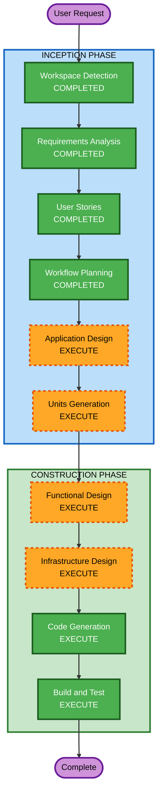

# Execution Plan

## Detailed Analysis Summary

### Change Impact Assessment
- **User-facing changes**: Yes — CLI agent with two interaction modes (single-shot + REPL)
- **Structural changes**: Yes — entirely new system with 4 components
- **Data model changes**: Yes — product catalog model, payment terms model
- **API changes**: Yes — new REST API (vending machine endpoints)
- **NFR impact**: Yes — observability pipeline, deployment to Lambda/AgentCore

### Risk Assessment
- **Risk Level**: Medium (multiple integrations: Bedrock, AgentCore Payments, Grafana OTLP)
- **Rollback Complexity**: Easy (greenfield — no existing system to break)
- **Testing Complexity**: Moderate (real Bedrock calls in integration tests, mocked payments)

## Workflow Visualization



### Text Alternative

```
INCEPTION PHASE:
  1. Workspace Detection ........... COMPLETED
  2. Requirements Analysis ......... COMPLETED
  3. User Stories .................. COMPLETED
  4. Workflow Planning ............. COMPLETED
  5. Application Design ........... EXECUTE
  6. Units Generation ............. EXECUTE

CONSTRUCTION PHASE:
  7. Functional Design ............ EXECUTE (per-unit)
  8. Infrastructure Design ........ EXECUTE (per-unit)
  9. Code Generation .............. EXECUTE (per-unit)
 10. Build and Test ............... EXECUTE
```

## Phases to Execute

### INCEPTION PHASE
- [x] Workspace Detection (COMPLETED)
- [x] Requirements Analysis (COMPLETED)
- [x] User Stories (COMPLETED)
- [x] Workflow Planning (COMPLETED)
- [ ] Application Design - EXECUTE
  - **Rationale**: New system with multiple components needing high-level design — component identification, service boundaries, and interaction patterns
- [ ] Units Generation - EXECUTE
  - **Rationale**: System decomposes into multiple units of work (vending machine API, agent, observability, infrastructure) that benefit from structured breakdown

### CONSTRUCTION PHASE
- [ ] Functional Design - EXECUTE (per-unit)
  - **Rationale**: x402 payment flow, agent reasoning loop, and product catalog have business logic requiring detailed design
- [ ] NFR Requirements - SKIP
  - **Rationale**: Tech stack fully specified in technical-environment.md; no additional NFR assessment needed
- [ ] NFR Design - SKIP
  - **Rationale**: No complex NFR patterns beyond what's already specified (observability wiring is functional, not an NFR pattern)
- [ ] Infrastructure Design - EXECUTE (per-unit)
  - **Rationale**: CDK infrastructure needs detailed mapping — Lambda, API Gateway, AgentCore Runtime, IAM roles
- [ ] Code Generation - EXECUTE (per-unit, ALWAYS)
  - **Rationale**: Implementation planning and code generation for all units
- [ ] Build and Test - EXECUTE (ALWAYS)
  - **Rationale**: Build verification, unit tests, integration tests

### OPERATIONS PHASE
- [ ] Operations - PLACEHOLDER

## Success Criteria
- **Primary Goal**: End-to-end autonomous agent purchase flow working (agent → discover → pay → receive)
- **Key Deliverables**:
  - Working vending machine API (FastAPI + Mangum)
  - Working AI agent (Strands SDK + AgentCore Payments)
  - Observability pipeline to Grafana Cloud
  - CDK infrastructure for all components
  - Comprehensive test suite
- **Quality Gates**:
  - All unit tests pass
  - Integration test with real Bedrock succeeds
  - `ruff` and `mypy` pass clean
  - Local development workflow functional
  - CDK synthesizes without errors
